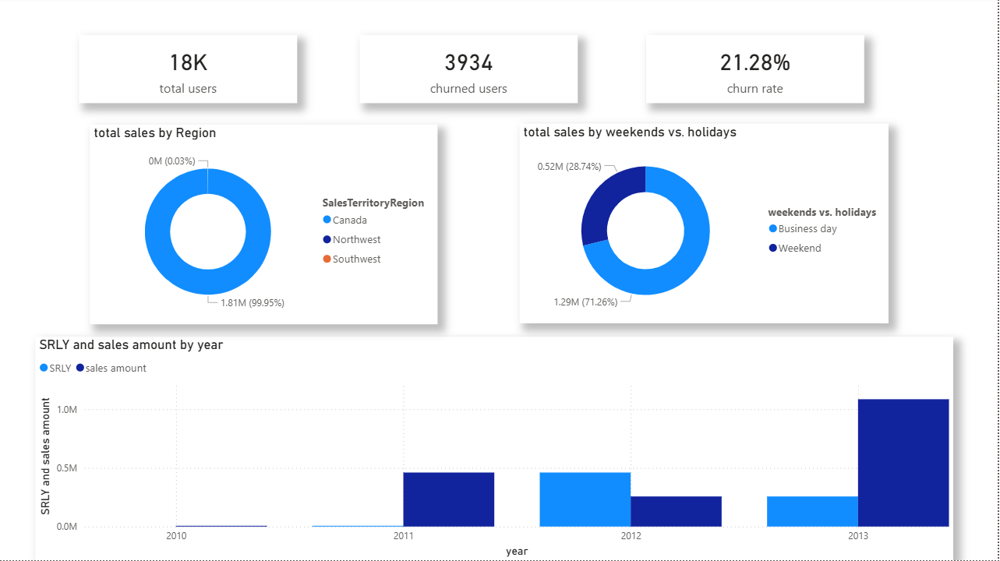
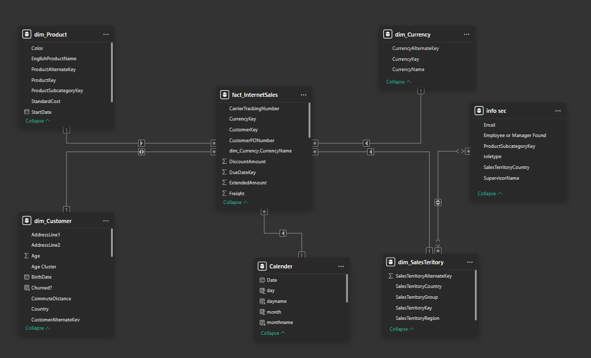

# 🛡️ Dynamic Row-Level Security (RLS) Implementation in Power BI

---

## 📌 Project Overview

This project showcases a professional implementation of **Dynamic Row-Level Security (RLS)** in Power BI. The core objective was to build a secure, scalable reporting solution where data access is automatically governed by the user's identity (Email) and their assigned organizational role.



---

## 🎯 The Challenge

In many organizations, a single report must serve different user levels. Creating multiple versions of the same report for different employees is inefficient and hard to maintain.

**The Goal:** Build one report that dynamically filters data so:
- **Managers:** Can see all global data.
- **Employees:** Can only see data related to their specific email.

---

## 🛠️ Technical Implementation

### 1. Data Modeling (Star Schema)

I implemented a Star Schema to ensure high performance. The security table (`info sec`) is linked to the core dimension tables, allowing the security filters to propagate seamlessly to the fact table.



### 2. Advanced DAX Logic

The engine of this project is a dynamic DAX expression applied to the security roles. It uses `USERPRINCIPALNAME()` to identify the logged-in user and `LOOKUPVALUE` to verify their permissions.

```dax
VAR CurrentUserEmail = USERPRINCIPALNAME()

-- Step 1: Check if the user exists in our authorized list
VAR IsFound = 
    LOOKUPVALUE('info sec'[Employee or Manager Found], 'info sec'[Email], CurrentUserEmail) = "Yes"

-- Step 2: Determine the user's role (Manager vs. Employee)
VAR UserRole = 
    LOOKUPVALUE('info sec'[roletype], 'info sec'[Email], CurrentUserEmail)

RETURN
IF(
    IsFound, 
    IF(
        UserRole = "manager", 
        TRUE(),                        -- Managers: Full access to all data
        [Email] = CurrentUserEmail     -- Employees: Filtered to their specific account
    ),
    FALSE()                            -- Non-authorized users: Zero data visibility
)
```

---

## 🧪 Security Validation (Testing)

Used the **"View as"** feature in Power BI to validate that the security logic holds under different scenarios:

| Scenario | User Role | Result |
|----------|-----------|--------|
| **Scenario A** | Manager View | Full Data Visibility |
| **Scenario B** | Employee View | Dashboard auto-filters to show **only their assigned territory** and related records |

---

## 🚀 Key Business Benefits

| Benefit | Description |
|---------|-------------|
| **Scalability** | No need to update the report when a new employee joins — simply update the source `info sec` table and the report adapts automatically. |
| **Data Governance** | High-level security ensuring that sensitive sales data is only visible to the right people, maintaining strict organizational privacy. |
| **Reduced Maintenance** | One single `.pbix` file serves the entire organization, eliminating the need for redundant departmental reports. |

---

## 👤 Author

| Field | Info |
|-------|------|
| **Name** | Samir Hendawy |
| **Role** | Data Analyst / Analytics Engineer |
| **Connect** | [LinkedIn](https://www.linkedin.com) |
